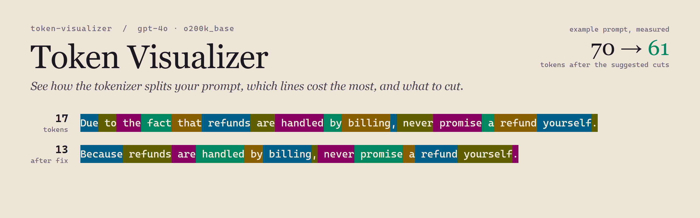
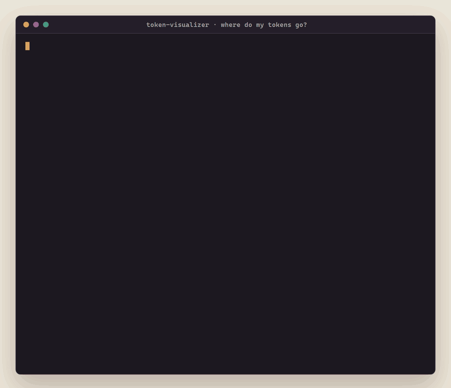

<p align="center"></p>

# Token Visualizer

**Shows you exactly how an AI model chops your prompt into tokens, which lines cost the most, and which wordy phrases to cut, with the real savings measured.**

[](https://github.com/Mattbusel/Token-Visualizer/actions/workflows/ci.yml)

<p align="center"></p>

### Which one do I want?

This repo has a sibling, [tokenviz](https://github.com/Mattbusel/tokenviz). Both count tokens with OpenAI's `tiktoken`; they answer different questions.

| You want to... | Use |
| --- | --- |
| See the exact token boundaries, one colored chip per token | **Token-Visualizer** (this one) |
| Get suggestions for wordy phrases, plus the token savings measured by re-tokenizing | **Token-Visualizer** |
| Count with a Hugging Face tokenizer (Llama, BERT, ...) | **Token-Visualizer** (from source, with `transformers`) |
| Paste a prompt into a window without touching a terminal (Windows double-click) | **Token-Visualizer** |
| Rank a long prompt's lines by cost with `--top` / `--threshold` | [tokenviz](https://github.com/Mattbusel/tokenviz) |
| Fail a CI job when a prompt goes over a token budget, or get JSON | [tokenviz](https://github.com/Mattbusel/tokenviz) (`--budget`, `--json`) |

## Install

| Platform | Command |
| --- | --- |
| macOS / Linux (Homebrew) | `brew install mattbusel/tap/token-visualizer` |
| Windows (Scoop) | `scoop bucket add mattbusel https://github.com/Mattbusel/scoop-bucket; scoop install mattbusel/token-visualizer` |
| macOS / Linux (script) | `curl -fsSL https://raw.githubusercontent.com/Mattbusel/Token-Visualizer/main/install.sh \| sh` |
| Windows (PowerShell script) | `irm https://raw.githubusercontent.com/Mattbusel/Token-Visualizer/main/install.ps1 \| iex` |
| Any OS with Python 3.8+ | `pipx install git+https://github.com/Mattbusel/Token-Visualizer` |
| Manual download | [Latest release](https://github.com/Mattbusel/Token-Visualizer/releases/latest): Windows zip, macOS (Apple Silicon or Intel) and Linux tarballs |

The downloads are single files with the GPT tokenizers built in, so they work offline. The two scripts check the SHA-256 against the release's `SHA256SUMS.txt` before installing: `install.sh` puts `token-visualizer` in `~/.local/bin`, `install.ps1` puts `token-visualizer.exe` in `%LOCALAPPDATA%\Programs\token-visualizer` and adds it to your user PATH. Hugging Face tokenizers are not in the downloads; for those use pipx or source with `transformers` (below).

<details><summary>Unsigned binary warnings</summary>

Windows SmartScreen may say "unknown publisher": click **More info**, then **Run anyway**. On macOS, if a manually downloaded binary is blocked, right-click it and choose **Open** the first time, or run `xattr -d com.apple.quarantine token-visualizer`. Homebrew, Scoop and the install scripts do not trigger this.
</details>

## Use it in 3 steps

1. **Save your prompt to a file** (or skip this and paste, see step 3).

2. **Run it on the file**, optionally naming the model whose tokenizer you care about:
   ```bash
   token-visualizer prompt.txt              # GPT-4 tokenizer (cl100k_base)
   token-visualizer prompt.txt -m gpt-4o    # GPT-4o tokenizer (o200k_base)
   cat prompt.txt | token-visualizer        # pipes work too, and never ask questions
   ```
   You see totals, a per-line breakdown (green under 25 tokens, yellow 25 to 50, red over 50), every token as a colored chip (for texts up to 200 tokens), wordy phrases with shorter replacements, and how many tokens those fixes actually save.

3. **Or just paste.** Run `token-visualizer` with nothing after it (or double-click `token-visualizer.exe` on Windows), paste your prompt, press Ctrl+D (Ctrl+Z then Enter on Windows), then pick a tokenizer from the menu.

## Results

Real output from today for [`examples/support-prompt.txt`](examples/support-prompt.txt), a 5-line support-bot prompt, with `-m gpt-4o`. The token chips are in the GIF above; here is the end of the report:

```text
COMPRESSION SUGGESTIONS
────────────────────────────────────────────────────────────────────────
  Verbose phrases found:
     'in order to' → 'to'
     'due to the fact that' → 'because'
     'in the event that' → 'if'

MEASURED SAVINGS
  Applying the phrase and whitespace fixes: 70 → 61 tokens (-9, 13%)
  Re-tokenized with the same tokenizer; $0.0003 less per request at $0.03 per 1K.
```

The savings are not a guess: the tool applies its own phrase swaps and whitespace fixes to your text and tokenizes the result again.

<details><summary>What it checks</summary>

- **Token counts** with `tiktoken` for GPT model names (unknown GPT names fall back to `cl100k_base`), or a Hugging Face `AutoTokenizer` for any other model ID when `transformers` is installed. The header says which tokenizer was really used.
- **Line breakdown**: each line's tokens and characters per token. Lines over 50 tokens are listed again as expensive.
- **Token boundaries**: in a terminal, each token on its own colored background with `↵` for newlines; without colors, an indexed grid like `[0:You] [1: are]`.
- **Suggestions**: repeated words, five wordy phrases (`in order to`, `due to the fact that`, `at this point in time`, `for the purpose of`, `in the event that`), low characters per token, lines over 40 tokens, and extra whitespace.
- **Cost**: a rough figure at a fixed $0.03 per 1K input tokens (an old GPT-4 list price), clearly labeled as such.
</details>

<details><summary>All options</summary>

```text
usage: token-visualizer [-h] [-m MODEL] [--no-color] [--version] [file]

positional arguments:
  file                  text file to analyze (default: read stdin)

options:
  -h, --help            show this help message and exit
  -m MODEL, --model MODEL
                        tokenizer to use: gpt-4, gpt-4o, gpt-3.5-turbo,
                        claude-3-sonnet, llama-2-7b, any tiktoken model name,
                        or a Hugging Face model ID. Default gpt-4; only pasted
                        text gets a menu.
  --no-color            disable ANSI colors
  --version             show program's version number and exit
```

Colors turn off when output is not a terminal, with `--no-color`, or when `NO_COLOR` is set; `FORCE_COLOR=1` keeps them on in a pipe. The tokenizer menu only appears for pasted text; a file argument or a pipe uses `gpt-4` unless `-m` says otherwise, so scripts never hang.
</details>

<details><summary>From source, Hugging Face tokenizers, and use from Python</summary>

Python 3.8+. `tiktoken` is required for real GPT counts; `transformers` is optional.

```bash
git clone https://github.com/Mattbusel/Token-Visualizer
cd Token-Visualizer
pip install -e ".[hf,dev]"      # or: pip install tiktoken
pytest
python token_visualizer.py examples/support-prompt.txt -m bert-base-uncased    # a Hugging Face model ID
```

The old `python "Token Visualizer.py"` command still works.

```python
import token_visualizer as tv

viz = tv.TokenVisualizer("gpt-4o")
stats = viz.tokenize("Your prompt here")
print(stats.token_count, stats.efficiency)
print(viz.compress("In order to help you, due to the fact that you asked."))
# To help you, because you asked.
viz.visualize_tokens("Your prompt here")
viz.suggest_compression("Your prompt here")
```
</details>

## Limitations

- Anthropic does not publish a Claude tokenizer, and `claude-3-sonnet` and `llama-2-7b` in the menu are not Hugging Face model IDs, so those two fall back to whitespace splitting (the header says so). For real counts outside OpenAI models, pass a valid Hugging Face model ID with `-m`.
- With no tokenizer library at all, everything uses whitespace splitting, which undercounts real tokens.
- The cost figure uses a fixed historical price and is only a rough guide.

## License

MIT
