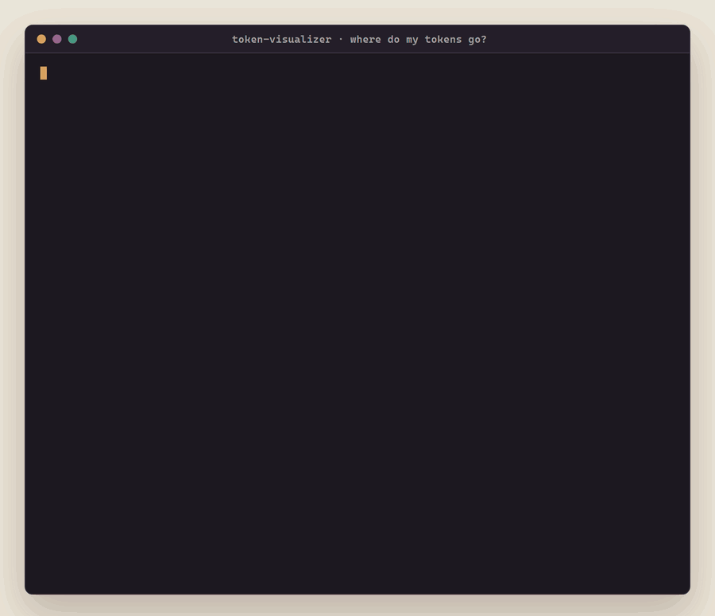

# Token Visualizer

**See how an AI model like ChatGPT chops your prompt into tokens, which lines cost the most, and which wordy phrases to cut, with the savings measured, not guessed.**

For anyone who writes prompts and pays per token: developers, prompt engineers, and anyone curious why a sentence "costs" what it does. A free LLM token counter for the terminal, using OpenAI's real tokenizers (GPT-4, GPT-4o, GPT-3.5) offline.

<p align="center"><a href="https://gitlab.com/mattbusel/Token-Visualizer/-/releases/permalink/latest/downloads/token-visualizer-windows-x86_64.exe"><b>Download for Windows (.exe)</b></a> &nbsp;&middot;&nbsp; <a href="#install">Linux and macOS</a> &nbsp;&middot;&nbsp; <a href="https://token-visualizer-app.vercel.app/">Project site</a> &nbsp;&middot;&nbsp; <a href="docs/REFERENCE.md">Docs</a></p>

<p align="center"></p>

## Install

**Linux** (x86_64, Ubuntu 20.04+ / Debian 11+). One line, no dependencies, installs to `~/.local/bin`:

```sh
mkdir -p ~/.local/bin && curl -fsSL https://gitlab.com/mattbusel/Token-Visualizer/-/releases/permalink/latest/downloads/token-visualizer-linux-x86_64.tar.gz | tar xz --strip-components=1 -C ~/.local/bin --wildcards '*/token-visualizer'
```

| Other systems | |
|---|---|
| **Windows** | [Download token-visualizer-windows-x86_64.exe](https://gitlab.com/mattbusel/Token-Visualizer/-/releases/permalink/latest/downloads/token-visualizer-windows-x86_64.exe) and run it. (Unsigned, so SmartScreen may ask: *More info*, then *Run anyway*.) |
| **macOS, or from source** | `pipx install git+https://gitlab.com/mattbusel/Token-Visualizer.git` (Python 3.8+) |

The downloads are single files with the tokenizer data built in, so they work offline. Every release, with SHA-256 checksums: [Releases](https://gitlab.com/mattbusel/Token-Visualizer/-/releases).

## How it works



1. **Cut.** The model's own tokenizer (`tiktoken`) splits each line into tokens, the numbered pieces a model reads and bills for.
2. **Count.** Every line gets a token count, colored green, yellow or red, and the whole prompt gets a total and a rough cost.
3. **Measure.** It swaps wordy phrases for short ones, squeezes extra whitespace, runs the new text through the same tokenizer, and reports the real difference.

## Examples

All real output from `token-visualizer` 0.3.1 today.

**1. A 5-line support prompt** ([`examples/support-prompt.txt`](examples/support-prompt.txt)), the end of the report:

```console
$ token-visualizer examples/support-prompt.txt -m gpt-4o
TOKEN ANALYSIS - GPT-4O  tiktoken o200k_base
  Total tokens: 70
  Total characters: 357
  ...
COMPRESSION SUGGESTIONS
  Verbose phrases found:
     'in order to' → 'to'
     'due to the fact that' → 'because'
     'in the event that' → 'if'

MEASURED SAVINGS
  Applying the phrase and whitespace fixes: 70 → 61 tokens (-9, 13%)
  Re-tokenized with the same tokenizer; $0.0003 less per request at $0.03 per 1K.
```

**2. One wordy sentence, piped in:**

```console
$ echo "In order to help you, due to the fact that you asked." | token-visualizer
  Total tokens: 14
  ...
  Applying the phrase and whitespace fixes: 14 → 8 tokens (-6, 43%)
```

**3. Exact token boundaries.** In a terminal each token is a colored chip (the GIF above); with colors off you get an indexed grid:

```console
$ echo "In order to help you, due to the fact that you asked." | token-visualizer --no-color
TOKEN BREAKDOWN:
  [0:In] [1: order] [2: to] [3: help] [4: you] [5:,] [6: due] [7: to] [8: the]
  [9: fact] [10: that] [11: you] [12: asked] [13:.\n]
```

Most tokens carry the space in front of the word, which is why ` order` and `order` are different tokens.

## Use it in 3 steps

1. **Get it:** use the Linux one-liner or the Windows .exe above, or `pipx`.
2. **Run it on your prompt:** `token-visualizer prompt.txt -m gpt-4o` (or double-click the .exe and paste, then Ctrl+Z and Enter).
3. **Cut what it flags** and run it again to see the new count.

`token-visualizer --help` lists every option with examples.

## Documentation

| Doc | What is in it |
| --- | --- |
| [Reference](docs/REFERENCE.md) | All options, what it checks, install details, Hugging Face tokenizers, use from Python, limitations |
| [Token-Visualizer or tokenviz?](docs/REFERENCE.md#token-visualizer-or-tokenviz) | Which of the two sibling tools to use for what |
| [Changelog](CHANGELOG.md) | What changed in each release |

Anthropic publishes no Claude tokenizer, so `-m claude-3-sonnet` falls back to whitespace splitting and the header says so. For Llama and other open models, pass a Hugging Face model ID (from source, with `transformers`). [Details](docs/REFERENCE.md#limitations).

## License

MIT, see [LICENSE](LICENSE).
